# Pipeline - Claude

[](https://claude.com/claude-code)
[](https://github.com/IvanMurzak/pipeline-claude/releases)
[](https://www.npmjs.com/package/@baizor/pipeline)
[](LICENSE)


**Long AI work, as ordered files in your repo.** A pipeline is a folder of
numbered markdown steps. A deterministic CLI decides what runs next — not the
model — and every step gets a fresh context, so a chain that takes hours never
drags a hundred thousand tokens of history behind it.

Two commands. The second one from the project where you want pipelines to live.

## Install

```bash
bun add -g @baizor/pipeline
pipeline init
```


`pipeline init` is the whole setup: one browser consent screen, then it connects
this project to your account, installs this plugin into Claude Code, clones a
starter pipeline into `./.pipeline/support-answer`, enrols this machine as a
runner that starts on boot, and offers to run that starter pipeline right there.
The install ends with a pipeline that has already run on your machine.

Restart Claude Code afterwards — a running session does not pick up a newly
installed plugin.

**No account wanted?** `pipeline init --local` does all of the above except the
cloud. No browser, no account, nothing sent anywhere.

<details>
<summary><b>Prerequisites, escape hatches, and installing the plugin by hand</b></summary>

<br>

**Two prerequisites, and `init` is explicit about both.**

- **Bun.** The CLI's executable is TypeScript, so Bun is required, not preferred.
  `pipeline init` stops immediately with the install URL if `bun` isn't found.
- **Claude Code, installed and authenticated** with your own subscription or API
  key. Pipeline steps are executed by `claude`; it is your account that runs them
  and your account that pays for them. If `claude` isn't on `PATH`, `init` says
  so, skips the plugin install and the starter run, and still exits 0 — the clone
  and the dashboard are done, and you re-run `pipeline init` once Claude Code is
  there.

**The cloud step is the only network step, and it is not a trapdoor.** Nothing
about your code or your keys goes with it: the control plane coordinates runs and
shows you their status, and by default receives metadata only — statuses,
timings, token counts — filtered on your machine before anything is sent. You do
not need an account first; signing in creates one, and your first organization is
created for you.

- **`pipeline init --local`** — everything except the cloud.
- A **failed or declined** connect is a warning, not an error. `init` finishes
  locally and exits 0; `pipeline cloud connect` picks it up later.
- `--server`, `--org` and `--project` pass through to that connect. Under
  `--json` no browser is ever opened: set `PIPELINE_MACHINE_TOKEN` to connect
  non-interactively (CI, bots, agents), or the cloud step is skipped with a
  stated reason and the rest still runs.

Every step of `init` is idempotent (a re-run prints a `✓` per already-satisfied
step and changes nothing) and independently skippable: `--no-plugin`, `--no-run`,
`--no-runner`, plus `--yes` / `--json` for scripted setups, and
`pipeline init <template>` to start from a different template
(`pipeline clone --list` shows them).

**Installing the plugin by hand.** It is one step of `init`. If you already have
the CLI — or you want the plugin on its own, without a starter pipeline — run
that step yourself from inside Claude Code:

```text
/plugin marketplace add IvanMurzak/pipeline-claude-marketplace
/plugin install pipeline@pipeline
```

**The global CLI is required, not optional.** Since plugin 0.93.0 the five hook
relays are CLI subcommands rather than files in this repository, so a session
started without `@baizor/pipeline` on `PATH` prints one actionable line from the
SessionStart hook and every hook then degrades to a silent no-op. Updates to the
plugin arrive via `/plugin update`; the CLI updates on its own npm version line.

</details>

## Your first pipeline

```text
/pipeline:clone support-answer
/pipeline:run ./.pipeline/support-answer
```

`run` takes the pipeline **directory** — the manifest decides which step is
first, and in what order the rest follow. Add `--resume` to pick a halted run
back up, or `--start <step-name>` to enter partway in.

Or describe what you want and let it author one:

```text
/pipeline:design a release pipeline — changelog, version bump, tag, GitHub release
```

Then, from any later task, stop choosing pipelines by hand:

```text
/pipeline:dispatch fix the flaky auth test in the checkout suite
```

`dispatch` matches your task against every pipeline manifest in the project with
a deterministic BM25 matcher — free, no model call — and only escalates to a
cheap Haiku disambiguator when the top two candidates are genuinely close. Most
tasks resolve on the free tier.

## Watch it run, from anywhere



`pipeline init` connects this project to [**ai-pipeline.dev**](https://ai-pipeline.dev),
where every run shows up live — status, step, elapsed, tokens, cost — with
pipelines rendered as node graphs that light up as they execute. A run that
parks for your approval says so, and you can answer it from the dashboard or
from your phone.

It runs on your metal. The cloud is a control plane, not a proxy: your
subscription, your API keys, your machines, and model traffic never touches it.
Metadata only by default — statuses, timings and token counts leave, transcripts
and code do not, unless you opt up per project. `pipeline init --local` opts out
of all of it and serves the same dashboard at `http://127.0.0.1:<port>/`.

---

## Documentation

- [What you get](#what-you-get) · [Token discipline](#token-discipline) · [Mental model](#mental-model)
- [Using the plugin in a consumer project](#using-the-plugin-in-a-consumer-project) — [cheat sheet](#cheat-sheet--which-command-does-what), [day 1](#day-1--author-and-run-your-first-pipeline), [day 2+](#day-2--picking-the-right-pipeline-for-a-task), [pitfalls](#common-pitfalls)
- [Iteration file shape](#iteration-file-shape) · [Finding the right pipeline](#finding-the-right-pipeline-for-a-task) · [Self-improving pipelines](#self-improving-pipelines)
- [Script extraction](#token-cheap-iterations-via-script-extraction) · [Script steps](#script-steps-zero-token-steps) · [`ci-wait`](#waiting-on-github-ci-without-burning-tokens-pipeline-ci-wait)
- [Measuring every run](#measuring-every-run-pipelinestats--pipelineoptimize) · [Nesting](#nesting) · [Parallel / DAG pipelines](#parallel--dag-pipelines-opt-in)
- [Configuration reference](#configuration-reference) · [Where things live](#where-things-live) · [Watching a run](#watching-a-run)
- [Departments](#departments-mcp--background-notifier) · [Resuming a halted pipeline](#resuming-a-halted-pipeline) · [Tips](#tips)

Related repositories: the remote runner that lets connected compute pick up
dispatched work lives in [`IvanMurzak/pipeline-runner`](https://github.com/IvanMurzak/pipeline-runner),
and the Codex build of this plugin in [`IvanMurzak/pipeline-codex`](https://github.com/IvanMurzak/pipeline-codex).

## What you get

**Five slash commands.**

| Command | What it does |
|---|---|
| `/pipeline:clone <template>` | Scaffolds a ready-made pipeline into `./.pipeline/<template>/`. `--list` shows them: `support-answer`, `ship-feature`, `example-minimal`. `--force` overwrites, `--dir` picks another project root. |
| `/pipeline:design <goal>` | Authors a new pipeline from a high-level goal — a `pipeline.yml` plus the markdown its steps read. Each step is one PR-sized unit of work. |
| `/pipeline:run <pipeline>` | Drives a pipeline end to end. Fresh context per step, resumable, liveness-tracked. |
| `/pipeline:dispatch <task>` | Picks the right pipeline for a task and runs it without asking. |
| `/pipeline:find <task>` | The same matcher with no model and no auto-run: ranked candidates, scores, matched terms, and every exclusion with its reason. Takes a GitHub issue URL, `owner/repo#N`, or a bare issue number. |

**Five subagents**, normally reached through those chains rather than by hand.

| Agent | Role |
|---|---|
| `pipeline-manager` | Drives one run's chain |
| `step-executor` | Runs a single step, in its own fresh context |
| `pipeline-improver` | Feeds what a run learned back into the pipeline's own prose |
| `pipeline-script-creator` | Extracts deterministic blocks out of markdown into scripts |
| `pipeline-disambiguator` | Breaks a close match — runs on Haiku to keep the ladder cheap |

**Departments.** A remote MCP server and a background notifier: hand a task to
another agent or team from inside Claude Code, and hear back when it needs you or
finishes — even after this session ends.
[Details below](#departments-mcp--background-notifier).

## Token discipline

Every step is read by a fresh-context executor **on every run**. A token spent in
step markdown is therefore paid forever, not once — which is why the architecture
looks the way it does.

| Rule | In practice |
|---|---|
| **Skills read only their own role's input** | `/pipeline:run` is a router and never opens a step body. `/pipeline:design` reads the project only while authoring. `/pipeline:dispatch` reads manifests, capped at 300 tokens each, because matching needs them. |
| **Steps get leaner over time** | Long deterministic blocks — build sequences, filesystem work, multi-call API chains — become scripts under `scripts/`, replaced by a one-line invocation. The executor reads one line; the logic runs in Bash, never through the model. |
| **The manifest is metadata, not a step** | Capped at 300 tokens, never auto-loaded, opt-in per step via an explicit `Context` reference. Adding a pipeline does not raise anyone else's baseline cost. |

## Mental model

A **pipeline** is a folder with a manifest and the markdown its steps read.

**A step is not a file.** It is an entry in `pipeline.yml`, identified by its
`name:`. Nothing about a step comes from disk — not its identity, not its order,
not its model, not its type. The files under `steps/` are prose a step is handed.

```
<your-project>/.pipeline/
└── <pipeline-name>/
    ├── pipeline.yml           ← THE definition: every step, in order
    ├── PIPELINE.md            ← optional prose for humans; not parsed
    ├── scripts/               ← optional — scripts called by `type: script` steps
    │   └── <name>.py          ← stdlib-only, cross-platform
    ├── _shared/               ← optional — markdown several steps compose in
    │   └── <fragment>.md
    └── steps/                 ← the markdown each step reads
        ├── <step-name>.md     ← no numeric prefix: order lives in the manifest
        └── ...
```

All files live inside **your current project** (the working directory Claude
Code was launched from). The plugin itself is read-only at runtime.

### The manifest — `pipeline.yml`

```yaml
schema: 2
name: release-api
description: Cut a release: bump, changelog, tag, publish.

execution: sequential
isolation: run

steps:
  - name: bump
    body: steps/bump.md
    model: haiku

  - name: changelog
    body: steps/changelog.md
    model: opus

  - name: publish
    type: script
    script: scripts/publish.py
    timeout: 300
    self_improve: false
```

One file says everything: order, models, isolation, which steps are
deterministic scripts, which prompts an automated pass may not rewrite. **An
unknown value is an error**, never a warning with a silent fallback — a pipeline
that looks configured while behaving otherwise is the failure this format exists
to remove.

Three things follow from "a step is not a file":

- **Order comes from the manifest** (and `needs:` when a step depends on
  something other than its predecessor). A step does not choose its successor,
  so a step that forgets to can no longer end the run as a silent success.
- **A step's prompt may be composed** from several files — `body:` takes a list,
  optionally conditional — so the paragraph every step needs lives in one place.
- **Renaming a body file changes nothing.** It is a file; the step is its name.

A pipeline may keep a `PIPELINE.md` for humans reading the folder as a knowledge
base. It is **not parsed** — configuration put there does nothing.

**Already have a v1 pipeline?** `pipeline migrate --to-manifest --root <dir>`
generates the manifest and prints the old→new step-name map. v1 pipelines keep
running meanwhile.

## Using the plugin in a consumer project

This section is the practical walkthrough — install once, then a small set of commands you'll use day to day. Everything below assumes you've run the install commands from the "Install" section at the top and that your terminal's working directory is your **consumer project's root** (the project where you want pipelines to live, not the plugin's own folder).

### Cheat sheet — which command does what

| You want to… | Use | Asks before running? | Cost |
|---|---|---|---|
| Author a new repeatable workflow | `/pipeline:design <goal>` | n/a (writes files) | one-time design cost |
| Pick a pipeline for a task and **see** the match before running | `/pipeline:find <task or GH issue URL>` | yes | ~zero LLM tokens |
| Pick a pipeline for a task and **just run it** | `/pipeline:dispatch <task>` | no | ~zero for ~80% of tasks; cheap Haiku for ambiguous; full only for chains |
| Run / resume a specific pipeline you already know the path of | `/pipeline:run <abs-path-to-pipeline-folder>` | no | n/a |

`/pipeline:design` is the only skill that **writes** files (your new pipeline). The matching skills (`find`, `dispatch`) are read-only inspections of `PIPELINE.md` manifests; the run skills (`run`, `dispatch`) execute pipelines that do whatever those pipelines say in their iteration `Steps`.

### Day 1 — author and run your first pipeline

1. **Decide on a *repeatable* goal.** Pipelines are for workflows that will run **many times** in this project — releases, audits, migration templates, "implement-task" scaffolds. **Do not** use them for one-shot tasks (single bug fix, single PR); the designer will push back on those by default.

2. **Design the pipeline.** From the project root:

   ```
   /pipeline:design Cut a release of the API server: bump version, run tests, build image, deploy staging, smoke-test, deploy prod
   ```

   The `/pipeline:design` skill will sketch the step list, confirm scope with you when non-trivial, then write the manifest and its step bodies under `./.pipeline/<pipeline-name>/` — a `PIPELINE.md` manifest plus an ordered `steps/01-*.md`, `steps/02-*.md`, …. Each iteration file is a self-contained PR-sized unit of work.

3. **Sanity-check the result.** Open the new folder yourself; read the manifest's `End State` and the first iteration's `Goal` / `Steps` / `Success Criteria`. The designer is good but not infallible — five minutes reading what it produced now saves ten minutes mid-execution. Edit by hand if needed; iteration files are just markdown.

4. **Run it.** Two equivalent options:

   ```
   /pipeline:run ./.pipeline/release-api
   ```

   …or, more naturally, hand the matcher a task and let it find the right pipeline:

   ```
   /pipeline:dispatch Cut a release of the API server with version 2.5.0
   ```

   `/pipeline:run` is the supervisor. It spawns a single `pipeline-manager` (depth 1) that drives the chain — running a fresh `step-executor` per iteration (depth 2) and chaining forward through every iteration until the pipeline declares completion or halts on a blocker — while `/pipeline:run` stays in the main session to own UI liveness, the human-facing report, and the hours-long nested-blocker poll-wait. You'll see banners in the terminal.

5. **Re-read the pipeline folder afterwards.** After a successful run, `.pipeline/<pipeline-name>/` is now both a workflow definition and a knowledge base — future maintainers (and future Claude sessions) can read it cold to understand the project's release process. Commit it to git.

### Day 2+ — picking the right pipeline for a task

Once you have a few pipelines in `.pipeline/`, you stop typing pipeline paths and start typing tasks. Two skills, same matcher, different ergonomics:

**Inspection — `/pipeline:find`.** Use when you want to see the match before committing.

```
/pipeline:find Reduce p99 latency on the /api/users endpoint by adding indexes
```

Output looks like:

```
▶ Task: Reduce p99 latency on the /api/users endpoint by adding indexes

Matches:
  1. optimize-db (score 3.42, matched: database, indexes, lookup, query)
     End state: Database query performance is improved through targeted index additions...
     First step: baseline

Excluded by Scope.Out:
  - tune-api-latency: Scope.Out includes ["database index changes"]; matching terms: ["database", "indexes"]

Run "optimize-db" now? [Y/n]
```

The "Excluded by Scope.Out" list shows pipelines the matcher rejected and **why**. That visibility is the whole point of the inspection variant — when the matcher excludes a pipeline you expected to win, the explanation tells you whether to fix the task wording, raise `--neg-threshold`, or edit the rejecting pipeline's `Scope.Out` bullet to be more specific.

**Autonomous run — `/pipeline:dispatch`.** Use when you trust the matcher.

```
/pipeline:dispatch Cut a release of the API server with version 2.5.0
```

Same first-tier match as `/pipeline:find` (stdlib BM25 + Scope.Out hard-filter). On ambiguity (top-2 BM25 scores within 2× of each other), it spawns a Haiku-based disambiguator subagent that reads the ambiguous candidates' manifests and picks one — fractions of a cent. On zero matches with chain phrasing in the task, it falls back to full-context chain detection. On a confident single match (the common case), it runs immediately with zero LLM cost on matching.

**Working from a GitHub issue.** Either skill accepts a URL or `owner/repo#NUMBER` instead of free-form text:

```
/pipeline:find https://github.com/myorg/myrepo/issues/247
/pipeline:dispatch myorg/myrepo#247
```

The matcher calls `gh issue view --json title,body` and uses the issue's title+body as the task. Useful for triaging incoming issues without copy-pasting their text.

### Day-2 — when nothing matches

If `/pipeline:find` returns no candidates and the excluded list doesn't reveal an obvious cause:

1. **Re-read your task wording.** Pipelines match on terminology that appears in `End State` / `Scope.In` / pipeline name. If you describe a "schema migration" but the relevant pipeline calls it "database evolution", your wording and the matcher's vocabulary don't overlap.
2. **Try `--neg-threshold 2`** (you can pass `--` flags after the task in the command if you need to). Default is 1, which is strict. Raising it to 2 means "only exclude if at least 2 task tokens overlap with `Scope.Out`."
3. **Author a new pipeline** with `/pipeline:design <goal>` if no existing pipeline really covers the task and the workflow will repeat.
4. **Fall back to a regular agent** (`Agent({subagent_type: "general-purpose", …})` or a domain-specific teammate) for genuinely one-shot work — pipelines are for *repeatable* workflows.

### Day-N — letting pipelines improve themselves

Pipelines get better over time without you intervening, on **two tiers**:

- **Tier-1 (between steps).** The executor flags any iteration whose docs were ambiguous, missing a step, or pointed at the wrong tool — it emits an improvement brief in its final report. The `pipeline-manager` automatically dispatches `pipeline-improver` between iterations, so the next iteration in the chain reads updated docs. The executor also flags long deterministic Steps blocks that are paying tokens on every fresh-context run; the improver passes those to `pipeline-script-creator`, which extracts the block to a Python script under `<pipeline-root>/scripts/<name>.py` and rewrites the iteration to invoke it with one command.
- **Tier-2 (end-of-run retrospective).** While a run is in flight, each step jots down *every* problem it hits — not just blocking ones — into a gitignored `.feedback/` folder inside your pipeline. At the end of the run the `pipeline-manager` hands the doc-related problems to one Opus `pipeline-improver` (and `pipeline-script-creator`) pass that consolidates them and fixes the pipeline's own docs in a batch. The pure-project problems it can't fix on its own — real code bugs, environment issues, general friction — are surfaced to **you** in the run's final report instead. The feedback folder is cleaned up afterward; the improvements live in the docs and the project/env problems live in the report.

You don't trigger any of this. It happens during normal `/pipeline:run` invocations. Over a few weeks of use, your pipelines drift toward "iterations contain only the parts that need agent judgment; everything else is in scripts" — which is the cheap-tokens steady state.

See "Self-improving pipelines" and "Token-cheap iterations via script extraction" sections below for the full mechanics.

### Common pitfalls

- **Running from the wrong directory.** Pipelines live in your **consumer project's** `./.pipeline/`, not in the plugin install folder. If `/pipeline:design` ends up writing somewhere unexpected, your CWD wasn't the project root. The plugin install dir (`${CLAUDE_PLUGIN_ROOT}`) is read-only at runtime; nothing should ever land there.
- **Designing one-shot pipelines.** Both `/pipeline:design` and the `/pipeline:design` skill agent will push back when your goal looks like a single-use task. Take the pushback — pipelines pollute `.pipeline/` if used for one-shot work, since that folder doubles as a knowledge base of your project's *recurring* processes.
- **Editing iteration files mid-chain.** If a pipeline is currently running (executor in flight), don't edit its iteration files by hand. Wait for the chain to halt or complete; then edit, then resume with `/pipeline:run <halted-iteration.md>`. Iterations are designed to be idempotent, so re-running from the halted step is safe.
- **Confusing the dispatch-tier-3 fallback for normal behavior.** If you find yourself paying full LLM cost on every `/pipeline:dispatch` call, your matcher is returning zero candidates because of vocabulary mismatch (your tasks don't share terms with manifest `Scope.In` / `End State`). Fix the manifests' wording or your task wording; don't accept tier 3 as the steady state.

## Iteration file shape

Every iteration file contains these sections (and the `/pipeline:design` skill agent enforces them):

```markdown
# <Iteration Title>

## Goal
One or two sentences.

## Context
- Links to prior iterations (absolute paths).
- Links to project files, specs, docs.

## Inputs
- Files to read, decisions already made, preconditions.

## Steps
1. Ordered, concrete actions — anything requiring agent judgment lives here.
2. Run: `python <abs-path>/scripts/<name>.py [args]` — for long deterministic blocks
   (build/test sequences, file-system manipulations, API call chains). These get
   extracted out of markdown into per-pipeline Python scripts to keep the
   per-iteration token cost low. See "Token-cheap iterations via script extraction" below.
3. More agent-judgment steps using the script's stdout / exit code.

## Success Criteria
- Verifiable, objective, binary.

## Next
- Absolute path to next iteration, OR "Pipeline complete."
```

## Finding the right pipeline for a task

Two user-facing skills, **same matcher under the hood, different ergonomics on top**:

- **`/pipeline:find <task-or-issue-url>`** — inspection variant. Deterministic-only (no LLM). Returns ranked candidates with score, matched terms, and excluded-with-reason output, then asks before running. Use when you want to see the match before committing.
- **`/pipeline:dispatch <task>`** — autonomous variant. Same matcher in tier 1, plus an LLM tiebreaker on ambiguity (tier 2) and a chain-detection fallback on no match (tier 3). Auto-runs without confirmation. Use when you trust the matcher to decide.

Both share the `pipeline match` command (`apps/pipeline-cli`, run with Bun) — it scores each pipeline's manifest with Okapi BM25 over the **positive corpus** (name + `End State` + `Scope.In` + `Glossary`) and hard-filters on the **negative corpus** (`Scope.Out`) via keyword overlap. The corpus split exists because BM25 (and embeddings) don't naturally understand negation — to a frequency-based scorer, "update the database schema" and "do not update the database schema" share most of their tokens and look similar. The structural fix is to score the positive bucket and filter the negative bucket separately. A pipeline whose `Scope.Out` reads "database schema migrations" is excluded — with an explicit reason — from a task that mentions "database schema", instead of being ranked alongside the actually-relevant pipeline.

### `/pipeline:dispatch`'s three-tier cost ladder

Each call walks down the ladder; it stops at the first tier that produces a usable answer.

| Tier | What runs | When | Token cost |
|------|-----------|------|-----------:|
| 1 | `pipeline match` (BM25 + keyword filter, run with Bun) | always | ~zero |
| 2 | `pipeline-disambiguator` agent (Haiku 4.5) with 2–5 ambiguous candidates' manifests inlined | when the matcher returns ≥ 2 candidates with top1/top2 score ratio < 2.0 | low — Haiku, scales with ambiguity not project size |
| 3 | Main-session reasoning over all manifests to detect a chain | when the matcher returns 0 candidates AND task contains chain phrasing (`then`, `after that`, `followed by`, …) | full — same as the pre-refactor design used to cost on every call |

The 80% case (one pipeline obviously matches): tier 1 only, no LLM. The 15% case (ambiguous): tier 1 + Haiku tier 2. The 5% case (chain across pipelines): tier 1 + tier 3. Average token cost per dispatch dropped by ~90% versus the pre-refactor design where every call paid the tier-3 cost.

Example output:

```
▶ Task: Cut a release of the backend server with a changelog update

Matches:
  1. release-server (score 5.0, matched: new, release, backend, server, changelog)
     End state: A new tagged release of the backend server is published to production with no rollback required.
     First step: bump

Excluded by Scope.Out:
  - migrate-db: Scope.Out includes ["server release"]; matching terms: ["release", "server"]
  - audit-deps: Scope.Out includes ["server release"]; matching terms: ["release", "server"]

Run "release-server" now? [Y/n]            # /pipeline:find — asks
▶ Why: BM25 confident match (ratio 4.2)    # /pipeline:dispatch — auto-runs
```

For a GitHub issue, run either skill with the URL: `/pipeline:find https://github.com/owner/repo/issues/123`. The matcher calls `gh issue view --json title,body` and uses that as the task. Useful when triaging incoming issues.

The matcher and the disambiguator both live in this plugin — nothing to install in the consumer project beyond **Bun** (already required by the bundled CLI); the matcher runs as the bundled `pipeline match` CLI. (`gh` is needed only for the `--issue` form.)

## Self-improving pipelines

Pipelines get better over time by feeding concrete lessons back into their own documentation. This works on **two tiers**.

**Tier-1 — between-steps improvement.** When `step-executor` finishes an iteration and realizes the iteration as written was flawed in a way that blocks the *next* step — missing a step, ambiguous success criterion, unstated precondition — it emits a structured improvement brief in its final report, describing (a) what was wrong, (b) what the correct knowledge is, and (c) the specific edits to apply. The `pipeline-manager` (depth 1 — dispatching the improver is a *between-steps, chain-orchestration* spawn, which is the manager's job, not the step-executor's) picks up the brief and dispatches `pipeline-improver` synchronously before spawning the next step-executor. The improver makes minimal, surgical edits to the iteration file (or `PIPELINE.md` for pipeline-wide invariants) and reports back; the manager then continues the chain so the next step-executor reads the updated files from disk. The next time anyone runs this pipeline, the improved iteration is smoother.

**Tier-2 — end-of-run retrospective.** Tier-1 only carries the single most-blocking flaw per step. To capture everything else, each `step-executor` *also* journals every problem it hits — doc flaws, ambiguities, script-extraction candidates, but also real project bugs, environment issues, and general friction — as individual files in a gitignored `<pipeline-root>/.feedback/<run_id>/` folder, written as it goes (so they survive a crash). After the whole run finishes (completes or halts), the `pipeline-manager` runs a retrospective: it splits the problems into **doc-actionable** (doc-flaw / ambiguity / script-candidate) and **human-only** (project-issue / env / friction). The doc-actionable ones go to a single Opus `pipeline-improver` batch pass that consolidates, dedups, and applies the doc fixes (reading current state first so it never re-does a fix Tier-1 already landed) and emits a list of confirmed script extractions for `pipeline-script-creator`. The human-only ones are summarized straight to you in the run's final report — the pipeline never tries to auto-fix your code or your machine. The feedback folder is deleted afterward; the doc improvements live in the iteration files, and the human-only summary lives in the report.

Boundaries:

- Improvements target pipeline **documentation** only (files under `.pipeline/<name>/`). Never consumer project code.
- Project-side bugs (real code issues, flaky tests, environment problems) do NOT trigger doc improvements — they are surfaced to you in the retrospective summary instead. Only flaws in the iteration's own docs are auto-fixed.
- The improver refuses changes that would break the chain, delete Success Criteria, or renumber files.
- Tier-1: one improvement brief per iteration, max. Tier-2: one batch improver pass per run, run once at the end (a no-op when no problems were journaled).
- The `.feedback/` tree is gitignored by a self-contained `.feedback/.gitignore` (a single `*`), so feedback never lands in your commits.

You can also invoke `pipeline-improver` directly via the `Agent` tool when you spot a pipeline-doc flaw yourself.

## Token-cheap iterations via script extraction

Iteration markdown is paid in tokens on every fresh-context run. A 60-line "do this then this then this" block of imperative shell-style detail in `Steps` becomes a permanent tax on every executor that ever reads the iteration. The plugin's `pipeline-script-creator` agent removes that tax by relocating deterministic procedural blocks to Python scripts.

How it lands automatically:

1. `step-executor` runs an iteration and notices a `Steps` block that is long, deterministic, and judgment-free. It includes a `SCRIPT-EXTRACTION CANDIDATE` bullet inside its `improvement_brief` (it does not extract scripts itself).
2. The `pipeline-manager` spawns `pipeline-improver` with the brief.
3. `pipeline-improver` applies any text edits, then — if the extraction is warranted — emits a `script_creation_briefs` list (0 or 1 entries in this between-steps path; several in the end-of-run retrospective) in its own structured final report. It does not write the script either; that is `pipeline-script-creator`'s job.
4. The `pipeline-manager` parses the improver's report and spawns `pipeline-script-creator` once per brief in the list, sequentially. The script-creator writes a cross-platform Python file under `<pipeline-root>/scripts/<name>.py`, runs `--help` to verify it parses, then rewrites the iteration's `Steps` to invoke the script with one command line.
5. The next executor starts in a fresh context and reads the slimmed-down iteration. Token cost on every future run drops accordingly.

Boundaries:

- Scripts live at `<your-project>/.pipeline/<pipeline-name>/scripts/<name>.py` — sibling to `steps/`, never inside it. Per-pipeline only; no cross-pipeline sharing in v0.8.0.
- Stdlib only by default. Cross-platform (`pathlib`, `tempfile`, no POSIX shell syntax). Argparse-driven CLI with `--help`. Idempotent.
- The script-creator refuses extractions that would require agent judgment, deletions of `Success Criteria`, renumbering, or breaking `Next` links. It is a leaf agent — it does not loop back to the executor or improver.

You can also invoke `pipeline-script-creator` directly via the `Agent` tool when you've drafted a structured `script_creation_brief` yourself and want to apply it manually.

## Script steps (zero-token steps)

Script extraction (above) removes the *heavy procedural block* from an agent iteration — the agent still reads the script's result and decides what to do next. When a **whole** iteration is deterministic — a build gate, a CI wait, a fixed file/API sequence with no judgment at all — you can go one rung further and make the step itself the program, with **no agent involved**. Add `type: script` to the iteration's frontmatter and the `pipeline next` engine runs it **in-process, for zero LLM tokens** (the same mechanism that runs external-isolation worktree hooks). A fully deterministic iteration that used to cost a ~10–20k-token step-executor spawn now costs nothing.

The three-rung extraction ladder:

1. **Inline `Steps`** — only where agent judgment is needed.
2. **A script called from inside an agent step** — the script-extraction path above; the agent still reads the result and decides.
3. **`type: script`** — the whole step is the program (this section).

It is fully backward-compatible: absent `type:`, a step is an `agent` step exactly as before, and an old runtime that doesn't understand `type: script` treats the file as a plain agent step (via a one-line `## Steps` fallback).

A minimal script step — the whole declaration is a manifest entry:

```yaml
  - name: wait-ci
    type: script
    script: scripts/wait-ci.py     # path relative to the pipeline root
    timeout: 1800
    retries: 2                     # re-run transient failures (network blips)
    on_failure: halt               # or 'agent' to fall back to a step-executor
    params:
      pr_number:
        type: number
        required: true
        from: ${steps.open-pr.output.pr_number}
    output:
      ci_green:
        type: boolean
```

The script prints one JSON object as its last stdout line:
`{"ok": true, "flags": {"ci_green": true}, "output": {…}}`.

`ok:true` means "the step did its job" — a domain "no" (CI red, nothing to release) is still `ok:true` with a `flags` entry the pipeline's `## Graph` routes on. `ok:false` is reserved for "the step could not run at all" and (with `on-failure: halt`) stops the run. `flags` become the step's `result_flags`; anything in `output` is persisted so later steps can bind to `${steps.wait-ci.output.checks_passed}`.

Test a script step in isolation before wiring it into a chain — no run required:

```
pipeline step run ./.pipeline/release-api/steps/03-wait-ci.md --param pr_number=132 --json
```

The full contract — the manifest keys, the `params:` / `output:` vocabulary and `${…}` bindings, the **frozen** process I/O contract (env vars, params file, stdin/stdout, exit semantics, the `ok:false` rule), the failure classes + `retries` / `on-failure` agent fallback, the timeout/call-budget ladder, the attempt ledger (idempotency), the outputs store, and secrets handling — is in **[`docs/script-steps.md`](docs/script-steps.md)**.

## Waiting on GitHub CI without burning tokens (`pipeline ci-wait`)

The classic agentic-workflow money pit: a step needs CI to pass, so the agent hand-rolls a poll loop — sleep, run `gh pr checks`, read the whole check table into context, repeat — burning a full agent turn per poll. Worse, agents happily wait **hours** for full CI completion when one job already failed (or hung) and the outcome was decided long ago.

`pipeline ci-wait` replaces the loop with ONE Bash call that blocks until CI reaches a terminal state and prints ONE compact result:

```
pipeline ci-wait --pr 123 --json          # wait on a pull request's checks
pipeline ci-wait --branch main --json     # wait on a branch's HEAD commit (sha pinned at start)
pipeline ci-wait --json                   # no selector = the repo's default branch
```

- **Fails fast by default.** The FIRST failed or cancelled check ends the wait immediately — even while other jobs are still running or stuck. Pass `--no-fail-fast` when you genuinely need the full picture.
- **Never blocks forever.** `--timeout <sec>` (default 1800) caps stuck CI → exit 3 with the still-pending check names; `--grace <sec>` (default 120) bounds the "CI never started" case → exit 4, deliberately distinct from success so "no checks" can never read as a green gate.
- **Silent while waiting.** No output until the verdict (opt into stderr heartbeats with `--verbose`); the result is one line, or one JSON object with `--json`.
- **Exit codes are the contract**: `0` all passed · `1` a check failed · `2` usage / `gh` missing · `3` timeout · `4` no checks appeared. An iteration step just runs it and branches on the code — no poll loops in step docs.

`--pr` accepts a number, URL, or head-branch name (via `gh pr checks`, covering Actions and third-party checks). `--branch`/`--sha` poll the commit check-runs API; a branch is resolved to its HEAD sha once at start, so a later push is a new gate rather than a moving target. Requires an authenticated `gh` CLI (`--repo <path>` selects which repo's remote to use; default: the current directory).

## Measuring every run (`.pipeline/.stats/` + `/pipeline:optimize`)

Every pipeline run is measured by **pure software — no AI agent, zero LLM tokens**. It is ON by
default (`PIPELINE_STATS_ENABLED=0` disables). The `pipeline next` engine appends a timeline as the
run progresses and finalizes it at the terminal action; token counts are then folded in from the raw
manager + subagent transcripts (the only complete token source) by whichever rung gets there first —
the `Stop`/`SubagentStop` relay, the next run's init, or
`pipeline stats backfill` on demand. All three call one shared core, so the numbers are identical
whichever one fills them in, and a run whose enrichment was missed is reconciled later instead of
staying blank forever. You get
simple text files to review whenever you like:

```
.pipeline/.stats/
  SUMMARY.md                      # the whole picture: per pipeline — runs, success rate,
                                  #   avg duration, avg out-tokens, avg tool fails,
                                  #   last run + recent-runs table
  <pipeline>/runs.jsonl           # one machine-readable record per finished run
  <pipeline>/runs/<run-id>.log    # human per-run timeline: step-by-step timings, outcome,
                                  #   tokens + a "tool fails" section (per-failure detail)
```

**Tool failures are measured, not just outcomes.** Enrichment also records how many tool calls
FAILED during the run (`tokens.tools_failed` + a per-tool breakdown like `{"Bash": 5}`), and
appends each failure — timestamp, tool, the step it happened in, the error the tool returned —
to the run's `.log`. A run can be "completed" and still be sick: dozens of failed calls mean the
steps are retrying their way to success on wrong instructions. Headless (`pipeline drive`) runs
fold their pinned per-step session transcripts at the terminal action, so their failures carry
exact step attribution; manager runs attribute by step time-windows.

View from the terminal any time with `pipeline stats [--project <path>] [--json]` (regenerates and
prints `SUMMARY.md`). Crashed/killed runs surface in SUMMARY under "in-flight or
crashed" via their leftover timeline buffers.

**Closing the loop — `/pipeline:optimize`.** A deliberately **user-invoked-only** skill
(`disable-model-invocation: true`, so no agent can auto-trigger it and burn tokens): run it weekly
(or whenever) and it reads `SUMMARY.md`, flags pipelines whose halts/duration/tokens regressed
against their own history — and pipelines with recurring tool failures (same tool failing run
after run) — digs into the relevant `runs/<id>.log` files only, and — with your approval —
applies targeted fixes through `pipeline-improver`. Failure-driven fixes are held to a standard:
only pipeline-attributable patterns (wrong command/path in a step's instructions, missing
preflight) get edits; one-off environment noise is reported, not "fixed". The stats files then
serve as the before/after evidence for whether each optimization helped.

## Nested-blocker delegation

Sometimes an iteration runs into a problem whose fix is clearly **outside the current task's scope** AND blocks further progress — a broken tool in a different module the task depends on, a missing upstream API, a regression in `main` that would need to land before this task can compile. For those cases the plugin splits the work between the executor (subagent, limited to preparing a brief) and `/pipeline:run` (main session, does the spawning and waiting — because a subagent cannot wait hours for a PR to merge or hold a long poll/merge loop across its finite context):

1. The executor stabilizes the parent branch (commits what's done, or reverts the unfinished chunk so the branch is green) and picks the blocker's target repo and base branch.
2. The executor emits a `blocker_delegation` brief in its final report with a full issue body, the child pipeline's first iteration path, a `partial_work_note` for resumption, and poll/deadline settings.
3. The `pipeline-manager` relays the brief up to `/pipeline:run`, which files a **new GitHub issue** on the blocker's target repo, posts a back-link on the parent's issue so the relationship is visible from both sides, and spawns a **child pipeline run** (a `pipeline-manager`) via the `Agent` tool. The child's worktree defaults to `main` of the blocker's target repo; the parent's branch is used as the base only when `main` lacks state that's strictly prerequisite for even starting the fix.
4. `/pipeline:run` **waits** — polling for the child PR to merge (default interval 5 minutes, default deadline 4 hours) — instead of advancing the chain.
5. On merge, `/pipeline:run` fetches the blocker target's updated base, merges (or rebases) it into the parent's branch, re-runs the iteration's verification gate, and re-invokes the `pipeline-manager` to re-enter the original iteration with the `partial_work_note` embedded in the prompt.

Closed-without-merging, merge conflicts, a red verification gate, or a deadline hit all halt the chain for human review rather than auto-retrying. The executor-side protocol (heuristics for in-scope vs tangent vs blocker, brief shape, executor invariants) lives in `step-executor`'s system prompt under "Nested-Blocker Delegation"; the caller-side flow (issue creation, child spawn, poll-wait, merge, re-invocation) lives in `/pipeline:run`'s skill under "Nested-Blocker Flow". If you edit one side, edit the other in lockstep.

## Nesting

When a single step is too large, split it into several steps. There is no
nesting to arrange: the manifest is a flat list, and `needs:` says what depends
on what — so "a sub-pipeline inside a step" is just more entries.

```yaml
steps:
  - name: plan
    body: steps/plan.md
  - name: scaffold
    body: steps/scaffold.md
  # what used to be a nested folder is three ordinary steps
  - name: core-module
    body: steps/core-module.md
  - name: adapters
    body: steps/adapters.md
  - name: wire-up
    body: steps/wire-up.md
  - name: verify
    body: steps/verify.md
```

## Parallel / DAG pipelines (opt-in)

By default a pipeline is a **linear chain** — iterations run one after another, in order. That is the right shape for almost everything and it is what you get unless you explicitly opt in. Nothing about sequential pipelines changed.

When a pipeline has **genuinely independent branches** — steps that touch disjoint files and have no ordering dependency on each other — you can let them run **concurrently**. Two optional fields turn it on:

- In the manifest: `execution: parallel`.
- On each independent step: `needs: [<step-name>, ...]` to declare exactly which steps must finish first.

A pipeline runs in DAG mode **only when `execution: parallel` is set** — `needs:` by itself is not enough. The graph is DATA: `needs:` always means what it says, and `execution:` decides only how much of it may run at once. So whenever you add `needss-on`, also set `execution: parallel`. Otherwise it stays sequential. In DAG mode the `pipeline-manager` runs each ready set of steps concurrently, **each in its own throwaway git worktree** (under `.claude/worktrees/`), then merges the finished branches back into your working branch one at a time. Because the steps are supposed to be independent, those merges should never conflict — if two parallel steps DID edit the same file, the merge conflicts and the whole run halts with a clear message (that means the pipeline was mis-designed; make those steps sequential or split the shared file out).

**Bringing your own isolation (`isolation: none`).** The per-step git worktree above isolates files but NOT environment/ports. If your pipeline already manages its own isolation — e.g. each step creates its own worktree and customises an env file so concurrent servers/ports don't overlap — set `isolation: manual` in `PIPELINE.md` frontmatter (default is `worktree`). In `manual` mode the manager spawns the parallel steps **in place** and does not create or merge any worktree of its own — your pipeline owns isolation end-to-end. Use it only when you genuinely run your own per-branch worktree/port scheme; otherwise leave the default.

Example: a `build` step, then `lint` / `typecheck` / `test` of disjoint modules running in parallel (each `needs: [build]`), then a `package` step that `depends-on: [lint, typecheck, test]`. Ask the designer to make independent branches parallel, or add the frontmatter by hand — it's just YAML.

Keep it sequential when in doubt; parallelism is an optimization for independent work, not a default.

- **`isolation: run` (run-level, sequential-only) — bring a consumer-provisioned worktree.** For *sequential* pipelines whose steps need project-specific provisioning the git-only worktree can't supply (allocated ports, dev secrets, a rendered `.env`, submodule worktrees), set `isolation: external` in `PIPELINE.md` frontmatter. The plugin then provisions ONE worktree per run: the bundled `pipeline next` CLI executes your convention-path hook scripts at `<project>/.pipeline/.hooks/worktree-{create,destroy}` itself, in-process (deterministic subprocess work — no agent involvement) — once at run start (before the first step), shared by every step, and torn down once on every terminal outcome (including halt). The hook contract is unchanged and frozen: inputs arrive as `PIPELINE_WT_*` environment variables, the create hook prints one JSON object (`worktree_path`/`branch`/`env_file`/`ports`) on stdout and is idempotent per name, the destroy hook prints `{"ok":true}` or soft-fails with `{"ok":false,"detail":"…"}` — existing hooks work unmodified. Your steps just `cd` into the provisioned worktree and source its env file; they don't re-allocate anything. Declare the submodules to include via `submodules: [a, b, c]`. If the hooks are missing the run halts (it never silently runs in-place). Combining `isolation: external` with `execution: parallel` degrades to `isolation: manual` with a warning — `external` is sequential-only.

  **Optional mandatory `finalize` stage.** For a run that must not be considered "done" until some project-defined terminal action has SUCCEEDED, add a `worktree-finalize` hook (its presence opts you in; or set `finalize: true` in `PIPELINE.md`). The CLI runs it once at the very end of a COMPLETED run — after the last step, before teardown — and it **must return `{"ok":true}` or the whole run HALTS with the worktree preserved** (so nothing is reaped). It is entirely GENERIC: the plugin has zero knowledge of what your finalize hook does (commit something, push, publish — anything); it only requires `ok`. The hook runs with `PIPELINE_WT_ACTION=finalize` plus the same `PIPELINE_WT_*` context as create/destroy. A pipeline that ships no finalize hook (and no `finalize: true`) is byte-for-byte unchanged — the stage never fires.

  **Worktree-scoped pipeline I/O (default).** An external-isolation run reads its pipeline definition from — and self-improves into — the run WORKTREE's pipeline copy: the CLI provisions at run init and plans from `<worktree>/<pipeline-root-rel>`, so a branch that modifies its own pipeline runs its own version, and improver/script-creator/retrospective edits ride your finalize commit/PR instead of dirtying the main checkout. Only **committed** state reaches the run (a worktree materializes commits; the CLI warns when the main pipeline dir is dirty). Run bookkeeping (`next.json`, events, `.stats`) stays under the main checkout, and `.gitignore` stubs inside the worktree keep run artifacts out of your finalize commit. Set `PIPELINE_WORKTREE_SCOPED=0` to restore the legacy main-scoped reads; the flag is frozen per run at init.

- **`pipeline submodule bump` — a guarded submodule-pointer bump (a git primitive your finalize hook can call).** When a run advances a git *submodule* and you need the SUPERPROJECT's pointer recorded on its base branch, do NOT hand-roll `git` for it — call the CLI command instead: `pipeline submodule bump --project-root <superproject> [--submodules a,b] [--base <branch>] [--source-worktree <path>] [--dry-run] [--json]`. It records the pointer change(s) and pushes them **isolation-safely** — the shared checkout is never `checkout`/`reset`/`switch`ed (its only mutation is `fetch` + `merge --ff-only`); all branch/commit work happens in a throwaway worktree off `origin/<base>`. Built-in guards make the dangerous mistakes *impossible*: it refuses to land a pointer that differs only because the base advanced past the run's fork (no accidental reverts), skips a pointer the base changed since the fork (no clobbering a concurrent bump), only bumps to a commit reachable from the submodule's `origin/<default>`, self-cleans orphaned throwaway worktrees from prior killed runs before it starts (idempotent), and STOPs on any error with a structured `halt_reason` + the exact manual recovery. It auto-detects drifted pointers from `.gitmodules` when `--submodules` is omitted, and a project with no submodules is a no-op. Output is one JSON object (`{status, bumped[], skipped[], pr, infra_sha, …}`); exit `0`/`1`/`2`. Needs `git` + `gh` on PATH.

## Configuration reference

Everything configurable, in one place. All fields are OPTIONAL — a pipeline with no frontmatter at all is a plain sequential chain driven by a pipeline-manager, with every step inheriting your session model.

**`pipeline.yml` — pipeline-level keys:**

| Key | Values (default first) | What it does |
|---|---|---|
| `schema:` | `2` | Required, exact. A manifest that does not say which format it is written in is the ambiguity v2 removes. |
| `name:` | — | Required. The pipeline's name. |
| `description:` | — | One line — shown by `/pipeline:find`, and matched against your task. |
| `execution:` | `sequential` \| `parallel` | `parallel` dispatches each dependency layer at once. The graph itself is `needs:`; this decides only how much of it may run together. |
| `isolation:` | `none` \| `step` \| `run` | The SCOPE of a git worktree: none, one per step (parallel layers, merged after), or one per run (consumer-provisioned, sequential-only). |
| `defaults:` | — | `model:` / `effort:` inherited by every step that does not set its own. |
| `base_branch:` | `main` | `isolation: run` only — what your create hook forks the run worktree from. |
| `submodules:` | `[]` | `isolation: run` only — submodule names the worktree should include. |
| `vars:` | — | `${PP_NAME}` values substituted into step prompts. |
| `self_improve:` | `true` | Whether automated passes may edit step prompts. A step can override it. |
| `flow:` | — | Conditional routing: step name → edges. Absent ⇒ the step list is the order. |

**`pipeline.yml` — per-step keys:**

| Key | Values (default first) | What it does |
|---|---|---|
| `name:` | — | Required, unique. THE step's identity — in `needs:`, in `flow:`, in `--start`, in the journal. |
| `type:` | `agent` \| `script` \| `pipeline` \| `gate` | What runs it. |
| `body:` | — | The markdown it reads. A path, or a LIST to compose several (optionally conditional). Required for an agent step. |
| `needs:` | *(the previous step)* | Which steps must finish first. `[]` means none — that is how a step joins the first layer. |
| `model:` / `effort:` | *(pipeline default)* | Pin this one step. |
| `retries:` | `0` | Bounded re-dispatch after a transient failure (agent and script steps). |
| `self_improve:` | *(pipeline default)* | `false` freezes this step's prompt — and every file it composes. |
| `script:` | — | `type: script` — the script to run, pipeline-root-relative. |
| `timeout:` / `on_failure:` | `600` / `halt` | `type: script` — seconds, and `halt` or an `agent` fallback. |
| `params:` / `output:` | — | `type: script` — its inputs and what it publishes downstream. |
| `pipeline:` / `args:` | — | `type: pipeline` — a child pipeline and its inputs. |
| `required_role:` / `message:` | — | `type: gate` — who may approve, and the prompt they see. |

A key on a step kind that cannot use it is an **error**, not a warning. A step
whose declared inputs never bind is the loudest failure this format prevents.

**Per-run model & effort overrides (no file edits):** to run the SAME pipeline once with different models or reasoning efforts on specific steps, pass overrides on the command — they beat the manifest for that run only and are persisted so resumes keep them.

**`flow:` (optional)** — conditional routing, as data rather than a mode:

```yaml
flow:
  review:
    - { when: changes_needed, goto: implement, max: 3 }
    - { goto: package }
  package:
    - { done: true }
```

`when` matches a result flag a step reported; `max` bounds how many times an
edge may be taken per run. Always end a conditional node with a default edge.

**Environment variables** (dashboard on/off, prompt-match hook, headless executor command, hook timeouts, debug flags): see [Environment variables (reference)](#environment-variables-reference) below.

## No leaked branches or worktrees

Cleanup is part of the run contract, and it is outcome-aware:

- **Parallel / DAG runs** (`isolation: worktree`): after each clean merge the runtime deletes the merged branch (`git branch -d`) and removes its worktree (retrying with `--force` when build artifacts block it). A COMPLETED parallel run leaves zero `worktree-*` branches and zero entries under `.claude/worktrees/`.
- **External-isolation runs**: on a COMPLETED run the destroy hook is invoked with `PIPELINE_WT_DELETE_BRANCHES=1` so the run branch dies with the worktree (opt out via `delete_branches: false`). On `halted` / `depth-exhausted` the worktree AND branch are deliberately preserved for post-mortem and resume — that is not a leak, it is evidence.
- **Failure paths are surfaced, never silent**: a merge conflict or mid-layer halt enumerates every not-yet-merged branch + worktree path in the halt detail.

Verify (or clean) at any time with the bundled janitor:

```
pipeline gc            # report: registered/stale worktrees, prunable records, orphaned worktree-* branches
pipeline gc --clean    # prune + remove merged-only worktrees + safe-delete (-d) merged worktree-* branches
```

**Submodules are scanned too** (skip with `--no-submodules`): external-isolation runs provision worktrees in every declared submodule, so historically each run leaked one `worktree-*` branch into EACH submodule repo. `gc` reports them per submodule against each repo's own default branch, and `--clean` applies the same safe rules inside every submodule.

`--clean` is conservative by design: it never force-deletes a branch, never touches unmerged work or the current checkout, and lists everything it kept and why. One documented exception exists for the machine-owned namespace: `--clean --force-worktree-branches` force-deletes (`-D`) UNMERGED `worktree-*` branches — needed because squash-merged run branches read as "unmerged" to git forever. It never touches branches outside that pattern.

## Where things live

| What                          | Where                                             |
|-------------------------------|---------------------------------------------------|
| Your pipelines                | `<your-project>/.pipeline/<pipeline-name>/...` |
| Parallel-step worktrees       | `<your-project>/.claude/worktrees/<auto-name>/` (transient — created + removed per DAG step) |
| Per-pipeline scripts          | `<your-project>/.pipeline/<pipeline-name>/scripts/*.py` |
| Per-run feedback (Tier-2)     | `<your-project>/.pipeline/<pipeline-name>/.feedback/<run_id>/` (gitignored, transient — created at run start, deleted after the end-of-run retrospective) |
| Plugin agents                 | `${CLAUDE_PLUGIN_ROOT}/agents/*.md` (read-only)   |
| Plugin skills                 | `${CLAUDE_PLUGIN_ROOT}/skills/*/SKILL.md` (read-only) |

The plugin never writes inside itself. Every pipeline file, every code edit performed by an executor, every log entry — all land in the consumer project's working directory.

## Watching a run

Runs are recorded as they happen in an append-only journal at
`<project>/.pipeline/.runtime/events.jsonl`. There are two ways to watch one.

**The hosted dashboard at [ai-pipeline.dev](https://ai-pipeline.dev)** is the UI.
Run `pipeline cloud connect` once and every run — from `/pipeline:run`,
`/pipeline:dispatch`, `pipeline drive`, or cloud dispatch — streams there: run
list, step tree, timings, token counts and cost, tool-call and failure counts,
the parked-question surface, and per-run analytics. It is installable as a web
app, so it works from a phone without exposing anything on your network. What it
receives is step metadata only — your prompts, transcripts, code, file paths,
tool arguments and error text never leave your machine — see
[Privacy tiers](docs/privacy-tiers.md), which lists the allowlist field by
field, and [Connecting to the cloud](docs/cloud-connect.md).

**`pipeline logs` is the offline path** and needs no account, no daemon and no
network — see the next section. `pipeline logs -f` tails the same journal live,
and `pipeline logs --chat <run-id>` renders a finished headless run's Claude Code
transcript in the terminal, which is the post-mortem a `pipeline drive` run
otherwise leaves scattered across files nobody opens.

> **Historical note.** Earlier versions shipped a *local* browser dashboard
> (`/pipeline:ui`, a background Bun daemon serving a React app). It was deleted:
> the hosted dashboard is already better at the shared 90%, and the two local
> capabilities without a cloud equivalent were moved into the CLI as
> `pipeline logs --chat` and `pipeline fix` before it went. `pipeline ui`,
> `/pipeline:ui`, the daemon and its `SessionStart` launcher no longer exist.

### Terminal logs — `pipeline logs`

Watch events scroll by in a terminal, pretty-printed as one line per event:

```bash
# from anywhere inside a pipeline project:
pipeline logs --follow
```

```
08:00:01 ▶ pipeline.started   abcdef12  build-cli [opus]
08:00:02 → iteration.started  abcdef12  #1 01-scaffold.md [opus]
08:00:03 · tool.called        abcdef12  Bash
08:00:05 ✓ pipeline.completed abcdef12  build-cli
```

Flags: `-f`/`--follow` to stream live, `--tail <n>` (default 20) for the initial backlog, `--all` for the whole journal, `--json` for raw JSON lines, `--no-color`, and `--project <path>` to point at a project other than the cwd. It is **read-only** — it starts no background process and writes nothing — so it works with or without a cloud account. Stop it with Ctrl-C.

`pipeline logs --chat <run-id>` is the other half: it renders that run's Claude Code transcript(s) in the terminal — the post-mortem for a headless `pipeline drive` run, whose steps execute as separate processes and whose subagent transcripts otherwise become files nobody opens. It reads only what is already on your disk and uploads nothing.

### The journal/analytics master switch — `PIPELINE_JOURNAL_ENABLED`

**The analytics hooks are ON BY DEFAULT** — they work out of the box, with no setup. To turn the whole system off, explicitly opt out by setting the environment variable `PIPELINE_JOURNAL_ENABLED` to a falsy value (`0`, `false`, `no`, or `off`):

```jsonc
// .claude/settings.json  (per project — hooks inherit the session env)
{ "env": { "PIPELINE_JOURNAL_ENABLED": "0" } }
```

> Renamed from the `PIPELINE_UI_` prefix in plugin-thin `p4` (clean break, no alias — there were no users to break). That prefix was a leftover from the deleted local dashboard; these variables gate the **journal**, which is not going anywhere.

While it is **unset** (the default), or set to any non-falsy value, the system is on:

- the `SessionStart` hook writes `session.opened`,
- the analytics hooks (`PreToolUse`/`PostToolUse`/`SubagentStop`/`Stop`) emit events and mirror bindings (the `Notification` hook is separate — it keeps its own `PIPELINE_AWAITING_INPUT_ENABLED` switch and still reports a blocked run when the rest is opted out).

When you opt out (`0`/`false`/`no`/`off`): the `SessionStart` hook does not write `session.opened`, and the analytics hooks emit nothing and do no filesystem work. Either way your pipelines run identically — the variable only controls the observability layer. You can also set it in your shell or OS environment before launching Claude Code. Because the hook *registrations* live in the plugin, Claude Code still launches each hook's (instantly-exiting) process even when opted out; to remove even that, disable the plugin. Your core run lifecycle is always journaled by `/pipeline:run`, so `pipeline logs` works as a lightweight terminal view regardless of this setting.

> Performance note: `SubagentStop` only fires the hook for the `pipeline-manager` subagent (via a `matcher`), so the dozens of other subagent stops in a run no longer spawn a hook process.

### Transcript opt-out — `PIPELINE_JOURNAL_TRANSCRIPTS`

Keep the journal on, but opt **out of the one privacy-sensitive part**: reading your Claude Code **transcripts**. `PIPELINE_JOURNAL_TRANSCRIPTS` is **ON BY DEFAULT** and, unlike the master switch above, gates **only** the transcript work — nothing else. Set it to a falsy value (`0`, `false`, `no`, or `off`) to disable just that:

```jsonc
// .claude/settings.json
{ "env": { "PIPELINE_JOURNAL_TRANSCRIPTS": "0" } }
```

What it gates (all OFF when opted out):

- the **transcript pointer** recorded on a run's mirror binding — the thing that makes a session's transcript reachable at all,
- the `Stop` hook's transcript **token tail** (`turn.usage`).

What keeps working:

- the basic pipeline-lifecycle events — `pipeline.*`, `iteration.*`, `tool.called`, `manager.stopped`, `session.opened` — and the run timeline/liveness they drive,
- run correlation: the mirror **binding is still written** (so events still attribute to the right run), just **without the transcript pointer**,
- `pipeline logs --chat`, which reads a transcript on your own disk on demand and never involves a pointer.

This switch is **orthogonal** to `PIPELINE_STATS_ENABLED` — the separate local `.pipeline/.stats/` measurement fold keeps its own switch and its own default. Setting `PIPELINE_JOURNAL_ENABLED=0` (the master switch) already turns everything off, so `PIPELINE_JOURNAL_TRANSCRIPTS` only matters while the hooks are on.

### Prompt match hook (opt-in) — `PIPELINE_PROMPT_MATCH_ENABLED`

The plugin also ships a `UserPromptSubmit` hook that surfaces a matching pipeline for whatever you just typed — deterministic auto-discovery with **zero always-loaded context**. It runs the same BM25 matcher `/pipeline:find` and `/pipeline:dispatch` use against your prompt, and **only on a confident single match** (exactly one candidate, or the top score at least 2× the runner-up — the same ambiguity threshold `/pipeline:dispatch` uses) injects one line of context suggesting `/pipeline:run <first-iteration>` or `/pipeline:dispatch`. On no match or an ambiguous match it stays completely silent; it never blocks or modifies your prompt.

Unlike the journal/analytics system (on by default), this hook is **OFF BY DEFAULT** and gated by its own environment variable (same non-falsy value parsing as `PIPELINE_JOURNAL_ENABLED`, but its own opt-in default):

```jsonc
// .claude/settings.json  (per project — hooks inherit the session env)
{ "env": { "PIPELINE_PROMPT_MATCH_ENABLED": "1" } }
```

When enabled, it still skips silently for slash commands, prompts shorter than 20 characters, and projects with no `.pipeline/` directory — so it only ever speaks up when a free-form task genuinely looks like one of your pre-authored pipelines.

### Environment variables (reference)

Everything the plugin reads from the environment, in one place. Set the per-project ones via `.claude/settings.json` → `"env": { ... }` (hooks and skills inherit the session environment).

**User-facing configuration:**

| Variable | Default | Purpose |
|---|---|---|
| `PIPELINE_JOURNAL_ENABLED` | **on** | Master opt-OUT for the journal/analytics hooks (`SessionStart` + `PreToolUse`/`PostToolUse`/`SubagentStop`/`Stop`). Enabled unless explicitly set to a falsy value; `0`/`false`/`no`/`off` disables, unset/empty/any other value enables. |
| `PIPELINE_JOURNAL_TRANSCRIPTS` | **on** | Opt-OUT for **only** the transcript work: the `transcript_path` pointer recorded on a mirror binding, and the `Stop` hook's token tail. `0`/`false`/`no`/`off` disables just that; the basic lifecycle events and run correlation keep working. Orthogonal to `PIPELINE_JOURNAL_ENABLED` and `PIPELINE_STATS_ENABLED`. |
| `PIPELINE_STATS_ENABLED` | **on** | Per-run measurement files under `.pipeline/.stats/` (durations, per-step timings, outcomes, tokens, tool failures — see "Measuring every run" above). Set `0`/`false`/`no`/`off` to disable. Independent of `PIPELINE_JOURNAL_ENABLED` and `PIPELINE_JOURNAL_TRANSCRIPTS`. |
| `PIPELINE_AWAITING_INPUT_ENABLED` | **on** | The `Notification` hook that journals `run.awaiting_input` when a permission prompt or an input request blocks the session — the `⏸` line in `pipeline logs` and the awaiting-input surface in the cloud dashboard. Deliberately INDEPENDENT of `PIPELINE_JOURNAL_ENABLED`: a blocked run is worth surfacing even when the rest is opted out. `0`/`false`/`no`/`off` disables. |
| `PIPELINE_PROMPT_MATCH_ENABLED` | off | Opt-in for the `UserPromptSubmit` pipeline-match hook (section above). Same non-falsy semantics. |
| `PIPELINE_DEPARTMENT_NOTIFY_ENABLED` | **on** | Opt-OUT for the departments background notifier (section above): its `SessionStart` launcher and the pending-notification drain. `0`/`false`/`no`/`off` disables; no-ops anyway until `pipeline cloud connect` has been run once. The old name, `PIPELINE_MESH_NOTIFY_ENABLED`, is still read as a fallback (with a deprecation warning) when this one is unset. |
| `PIPELINE_CLOUD_API` | `https://api.ai-pipeline.dev` | Overrides the control-plane API base used by `pipeline cloud connect` and the department notifier. |
| `PIPELINE_CLOUD_HOME` | platform default (`%APPDATA%\claude-pipeline` on Windows, `$XDG_CONFIG_HOME/claude-pipeline` / `~/.config/claude-pipeline` elsewhere) | Overrides the per-user directory holding the cloud credential store and the department notifier's journal/lock files. |
| `PIPELINE_MACHINE_TOKEN` | unset | The no-human path for `pipeline cloud connect` (bots, CI, autonomous agents): an `aip_m_<client-id>.<secret>` machine credential from your dashboard's Settings → Machine credentials. Its presence suppresses every prompt and browser/device-code attempt — pass `--org <slug>` too (a machine credential has no discoverable org). `--machine-token <token>` is the flag equivalent; the env var is preferred since argv is world-readable in `ps`. Combining either with `--device` is a usage error (exit 2). |
| `PIPELINE_DRIVE_EXECUTOR_CMD` | `claude -p --agent pipeline:step-executor --model {model} --effort {effort} --permission-mode {permissions} --session-id {session} --add-dir {record_dir} --plugin-dir {plugin_dir} --output-format stream-json --verbose --json-schema {schema}` | Overrides the command template the EXPERIMENTAL headless runner (`pipeline drive`) spawns per step. Whitespace-split; tokens `{model}` / `{effort}` / `{permissions}` / `{session}` / `{record_dir}` / `{plugin_dir}` / `{schema}` are substituted (a flag+token pair is dropped when the token has no value; on an answer/crash resume the flag before `{session}` becomes `--resume`); the step prompt always arrives on stdin. `{plugin_dir}` (CLAUDE_PLUGIN_ROOT) keeps `--agent pipeline:step-executor` resolvable once `-p` defaults to `--bare`; unlike `{session}`/`{record_dir}` it is never appended to a template that omits it, so a pre-existing override is unaffected. Equivalent to `--executor-cmd`. |
| `PIPELINE_HOOK_TIMEOUT_MS` | per-hook (600 000 create/finalize, 300 000 destroy) | Overrides the external-isolation worktree-hook timeout (positive integer, milliseconds). Mostly useful for testing hooks. |
| `PIPELINE_WORKTREE_SCOPED` | on | Worktree-scoped pipeline I/O for `isolation: external` runs (the run plans from, and self-improves into, the run worktree's pipeline copy — committed state only). `0`/`false` restores the legacy main-scoped reads. FROZEN per run into `next.json` at init — a mid-run flip never mixes path models within one run. |
| `PIPELINE_GIT_BIN` / `PIPELINE_GH_BIN` | `git` / `gh` from PATH | Override which `git`/`gh` binaries the CLI's guarded git operations (`pipeline submodule bump`) invoke. |
| `PIPELINE_JOURNAL_DEBUG` / `PIPELINE_RELAY_DEBUG` | off | `=1` prints diagnostic detail to stderr from the event writer / relay hooks. Debugging only. |

**Hook contract (set BY the plugin, read by your hook scripts):** every `PIPELINE_WT_*` variable passed to the `worktree-create` / `worktree-finalize` / `worktree-destroy` hooks is specified in [`docs/worktree-hook-contract.md`](docs/worktree-hook-contract.md) — that contract is frozen; write hooks against it, never set those variables yourself.

**Internal (do not set):** `PIPELINE_RUN_ID` / `PIPELINE_PARENT_RUN_ID` are run-correlation plumbing between `/pipeline:run` and the analytics hooks; setting them manually mis-attributes events. `PIPELINE_STATS_RUNNER` is set by `pipeline drive` to tag headless runs in the measurement files.

## Departments (`/mcp` + background notifier)

Separate from pipelines: a **department** is an agent somebody else runs, on somebody else's machine, that yours can hand work to. It has a name, a description and a list of skills; you don't install or clone it — you ask for it by name and [ai-pipeline.dev](https://ai-pipeline.dev) routes the task to whoever is serving it. This plugin is the client side of that, in three pieces: a **remote MCP server entry** so Claude Code can call departments inside a live session, a **background notifier** so a delegated task doesn't get lost if you close that session before it finishes, and the `pipeline department …` commands that publish a folder of your own as a department other people can call.

**The walkthroughs live on ai-pipeline.dev** — five pages, in order, every command on them pasted from a terminal where it ran. This section is the plugin-side reference and deliberately does not repeat them:

| Page | Covers |
|---|---|
| [Get started](https://ai-pipeline.dev/docs/getting-started) | `bun add -g` → `pipeline init` → one browser approval → a completed run on your account. `--local` for the same thing with no cloud at all. |
| [Connect the cloud](https://ai-pipeline.dev/docs/connect-the-cloud) | What `init` did for you, on its own: `pipeline cloud connect` — one browser approval, no token typed or pasted — and what the Free plan includes. |
| [Use a department](https://ai-pipeline.dev/docs/use-a-department) | `/mcp`, delegating in plain language, and what happens when a department asks you something back. |
| [Build a department](https://ai-pipeline.dev/docs/build-a-department) | `department.yml`, then `new` / `validate` / `serve` / `status`, and running the same department on another machine. |
| [Privacy tiers](docs/privacy-tiers.md) | Field by field, what leaves your machine once any of this is connected — transcribed from the filter that runs, with its real output. |

The plugin-internal contract behind the two client pieces — why the MCP entry and the notifier deliberately don't share a transport, what the `timeout` is sized against, and every file involved — is [`docs/departments-mcp.md`](docs/departments-mcp.md).

### Connecting — 2 steps, 1 browser hop, no token to paste

```
/mcp
```

1. Running `/mcp` (or just asking to delegate work — Claude Code triggers discovery automatically) lists `ai-pipeline-departments` as needing authorization; selecting it opens your browser to the departments' consent screen.
2. Log in if needed and approve — pick your org if you belong to more than one.

That's it, once per machine. Claude Code holds an audience-bound, scope-limited, short-lived credential from here on — never a long-lived token sitting on disk, and nothing to copy-paste. This is the same flow you'd use to connect any other remote MCP server; the plugin just ships the server's URL for you.

Once connected, delegating work is one line in natural language — "have the Unity department review the save system" — and the agent calls the departments' tools (`departments.list`, `tasks.send`, `tasks.wait`, …) on your behalf. A clarifying question along the way costs exactly one extra turn (you answer it like any other question); the result and any artifacts land back in your session.

> **One-time re-consent when you update to this version.** The MCP server key is `ai-pipeline-departments`; it was `ai-pipeline-mesh` before the terminology rename. That key is embedded in every tool's callable name (`mcp__plugin_<plugin>_<server>__<tool>`) and stored OAuth grants are keyed by it, so to Claude Code the renamed entry is a *new* server with no grant: run `/mcp` and approve once more. Nothing else about the connection changes. If you carry the old name in a `permissions.allow` entry, a skill's `allowed-tools`, a subagent's `tools` list or a hook matcher, update it too.

### Publishing one of your own — the `pipeline department` commands

A department is a folder whose only required file is `department.yml`. [Build a department](https://ai-pipeline.dev/docs/build-a-department) walks that end to end; these are the verbs it uses.

| Command | What it does |
|---|---|
| `pipeline department new [<name>]` | Scaffolds `department.yml` and **nothing else** — no `.claude/`, no README, no starter agent. The name defaults to the folder's. `--engine <id>` picks the runtime engine; `--from-pipeline <name>` prefills the description and one skill from an existing `.pipeline/<name>/PIPELINE.md` and points the manifest at it. |
| `pipeline department validate` | Checks a hand-written or hand-edited file: schema + `apiVersion`, engine support, coherence, advisory nits, and the local paths it names. Non-zero exit on any error, `--json` for scripts. It ends by listing what it structurally *cannot* check (a runner, a credential, the control plane) — that list is `serve`'s job. |
| `pipeline department serve` | One command from an authored file to a live department: validate, sign in, register (or update the registration when the manifest changed), enrol this machine as a runner if it isn't one, bind the runtime, ensure a supervisor is installed, claim the install, report. No separate connect step, no runner token. Idempotent and resumable from any partial state, and it writes nothing **inside** the department folder, so a department stays clonable. |
| `pipeline department status [--follow]` | State, plan budget, and recent tasks — from the control plane when a credential is already stored, from this machine's own binding state when it isn't. Never triggers an interactive sign-in. Each task line names who asked (sender) and what ran it (engine), read from this machine's own runner journal; a task this machine did not run shows `?` for both, with the reason, rather than being attributed to somebody else. |
| `pipeline department stop` | Local only: finishes in-flight tasks, refuses new offers, unbinds from this machine's supervisor. It never contacts the control plane, so the registration survives and `serve` brings it straight back — and it works with the network down. |
| `pipeline department retire` | The unpublish verb (owner role): soft-deletes the department from the org, fails its open tasks with a stated reason, and only **then** unbinds locally. That order is deliberate — if the cloud half fails, this machine is left exactly as it was rather than unserved while the control plane keeps routing to it. Destructive; refused without `--yes` when not interactive. |

Two things worth knowing before you author one:

- **`serve` reports only what it observed.** It prints `online` when the control plane says so, `registered — not serving` with the reason and the fix when this machine has no live supervisor, and `could not confirm it is live` when neither could be read. It does not assert success it hasn't checked.
- **The declared engine has to be one `pipeline-runner` actually ships a module for.** The scaffold's default is `claude-code`; when no module exists for the declared engine, `serve` refuses and registers nothing rather than publishing a department that could not execute a single task, and `validate`'s engine-support line tells you the same thing before you get there — one predicate behind both, so they cannot disagree. [Build a department](https://ai-pipeline.dev/docs/build-a-department) walks `engine: pipeline`, which turns a pipeline you already have into something your org can call, and states the current limit in the CLI's own words. Nothing about the file changes when a missing module ships: set `runtime.engine` and re-run `serve`.

### The background notifier — a parked task announces itself

Some department tasks take a while, and `tasks.wait` (the tool the agent loops on to watch a task) only blocks up to 45 seconds at a time by design — a live session loops it invisibly, but if a task needs your input or finishes **after you've closed that Claude Code session**, a plain MCP client has no way to tell you. This plugin ships a small background piece so that doesn't mean silence:

- A lightweight daemon (`pipeline department notify`) starts automatically the first time a `SessionStart` hook sees you've connected the CLI to the cloud (`pipeline cloud connect` — see below), and keeps polling your open department tasks in the background, independent of any open Claude Code session.
- The moment one of your tasks needs input or reaches a final state (done, failed, canceled, rejected), it fires a best-effort **OS-level notification** (a toast / notify-send / balloon, depending on your platform) right then.
- Every such transition is also written to a small durable queue, so even if you miss the toast (or your platform doesn't support one), the **next time you open Claude Code — in any project** — a `SessionStart` hook drains that queue and adds it as context, and the agent tells you about it.

You don't do anything extra to get this: it reuses the same credential `pipeline cloud connect` already stores (see `apps/pipeline-cli/src/lib/cloud-config.ts`) and needs no separate setup or consent step of its own.

```bash
# one-time (if you haven't already connected the CLI to the cloud for other reasons):
pipeline cloud connect

# manual smoke-test / debugging — runs one poll cycle and exits. This is the
# same binary the hook spawns: since plugin v0.93.0 the plugin ships no CLI of
# its own, so there is only ever one copy and it is the globally installed one.
pipeline department notify --once --json
```

Opt out with `PIPELINE_DEPARTMENT_NOTIFY_ENABLED=0` (same falsy-value convention as `PIPELINE_JOURNAL_ENABLED`) if you never want the daemon spawned or the queue drained. (`pipeline mesh notify` and `PIPELINE_MESH_NOTIFY_ENABLED` still work as deprecated, warning aliases for anyone with an existing service definition or shell profile.)

> **Implementation note for the curious:** the notifier polls the departments' REST task surface using the same credential `pipeline cloud connect` stores, rather than the `/mcp` tool surface Claude Code itself uses — a headless background process has no browser session to complete an OAuth consent flow in, so it reuses the credential that's already there. See the header comment in `apps/pipeline-cli/src/lib/department-notify.ts` for the full reasoning.

## Resuming a halted pipeline

If an executor halts on a blocker, fix the underlying issue, then re-invoke:

```
/pipeline:run <absolute-path>/.pipeline/<pipeline-name>/steps/<NN-halted-iteration>.md
```

Iterations are designed to be idempotent, so re-running from the halted step is safe.

## Tips

- Start with a clear one-sentence end-state when calling `/pipeline:design`. Vague goals produce vague pipelines.
- Prefer flat linear chains. Nest only when an iteration is itself a mini-pipeline.
- Pipelines double as a knowledge base: after completion, the folder documents *what was done and why* and can be read by humans or future agents.
